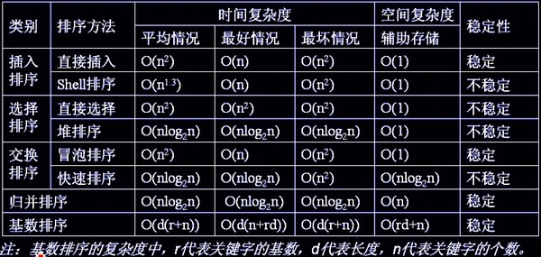
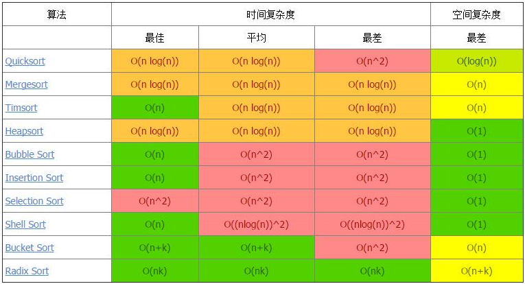
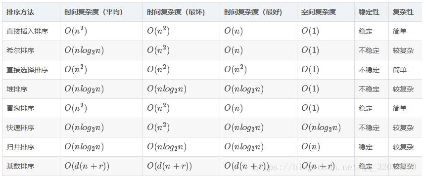

## 数组

- 查询更新快，时间复杂度O(1)；删除插入慢，时间复杂度O(N)。
- 删除插入慢的原因是要移动下标的位置，但是处理数组尾部的删除插入也是快的O(1)。

## 链表

- 非连续、非顺序的存储结构。
- 插入删除
  - 快O(1)；
- 查询慢O(N)，因为要遍历链表。
## 常用的时间复杂度量级

## 排序算法

> 冒选插希归：冒着雨去参加选举，碰见有人插队，就希望对方回去；
>
> 快堆计桶基：快点堆雪人，计算着桶里还有多少雪，可能不够打雪人的基础。

